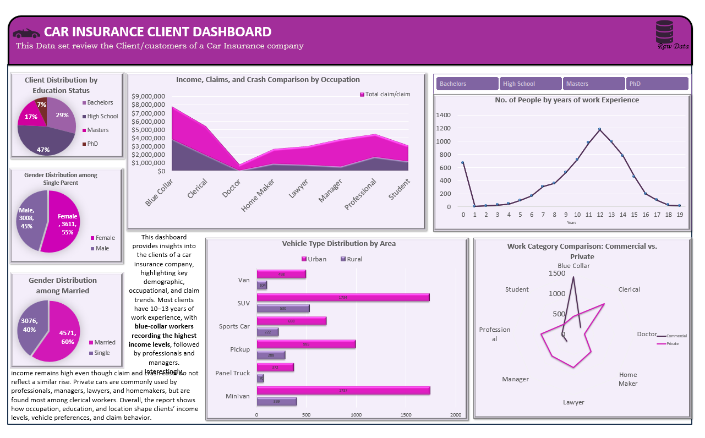

### Car Insurance Client 360° Analytics Dashboard

## Project Objective
The primary goal of this project was to perform a deep-dive analysis into the **full details of the client base** for a car insurance company. By aggregating demographic, occupational, and financial data, this dashboard identifies high-value segments and patterns in insurance claims to support data-driven decision-making.

## Key Insights & Discovery
* **Client Profiling**: Successfully mapped the distribution of education levels, revealing that 29% of clients hold a Bachelors degree, followed by 17% with Masters.
* **Income & Occupation**: Identified a unique trend where Blue-Collar workers record the highest income levels, providing a specific target for premium insurance packages.
* **Experience & Claims**: Analyzed the relationship between work experience (peaking at 10-13 years) and total claim costs to assess risk across the customer lifecycle.
* **Vehicle & Location**: Visualized preferences for vehicle types (SUVs, Minivans, Pickups) across Urban vs. Rural areas to understand regional market penetration.

##  Technical Implementation (The "Gangan" Part)
* **Dynamic Pivot Tables**: Used for real-time data aggregation of thousands of client records across multiple dimensions like Education, Gender, and Occupation.
* **Interactive Slicers**: Integrated slicers for **Education Status**, allowing stakeholders to filter the entire dashboard by PhD, Masters, High School, or Bachelors levels with a single click.
* **Advanced Visualizations**:
    * **Radar Charts**: To compare commercial vs. private work categories.
    * **Area Charts**: For tracking the relationship between income and crash comparisons.

##  Visuals

